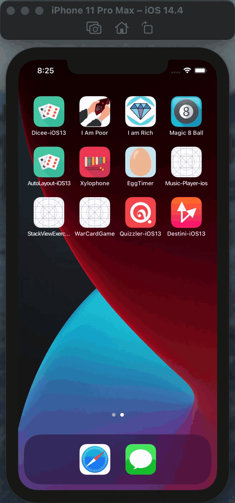

<h2>☑️ Goal</h2>

The goal of this app is to get comfortable with implementing the MVC design pattern and thinking about the state of app. In addition, reviewing the concept of Swift Structures and using it to separate the Model from the Controller.

<h2>☑️ What I created?</h2>

In this app, I created “choose your own adventure” game similar to the App Store  hit “Life Line” app. The app will tell a story depending on what the user chooses and can be fleshed out and modified to provide an engaging story-telling experience

<h2>☑️ Final look of Destini app🔮</h2>

